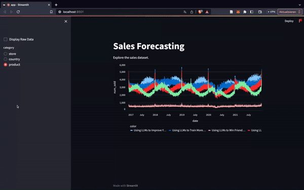

Sales Forecasting
=================

Description
-----------------
Forecasting sales for 2022 based on five years of data, using machine learning.

Installation
---------------

`> pip install -r requirements.txt`

Usage
-----------------
Web application built with [streamlit.io](https://streamlit.io/):

`> streamlit run visualization/app.py`

The notebooks for more detailed data exploration and model building can be found in `./notebooks`

Credit
---------
Data was provided by [kaggle](https://kaggle.com/competitions/playground-series-s3e19).